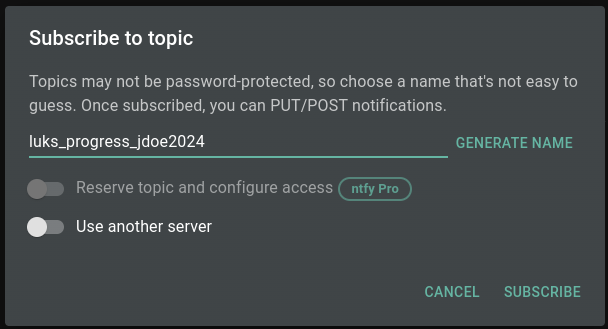

# LUKS Recovery Scripts

Below is detail about the scripts in this repository. To summarize, we want to accomplish the following:

1. Generate a wordlist with all combination of the elements of the suspected password.
2. Clean the derived wordlist from confirmed-bad, non-working passwords so that we don't waste our time re-checking passwords we know that don't work.
3. Run the brute-force and notify ourselves if it's found (audibly, and even by push notification on our phone, very easily with no account required)

Then, refine and repeat. If you thought of a new element, add it, regenerate the wordlist, prune away the known-incorrect entries (with `clean-wordlist.sh`), and re-run the brute force script.

## Script: `combine.sh`

This script will take the elements of `source1.txt`, `source2.txt`, and `source3.txt` to generate a `wordlist.txt` file.

The `wordlist.txt` file will contain every combination of the elements from the 3 source files, appended together.

> [!NOTE]
> For each of the source files, if you have one of the lines be an empty line (no spaces or tabs), that will allow ALL combinations including:
>
> * source1
> * source2
> * source3
> * source1 + source2
> * source1 + source3
> * source2 + source3
> * source1 + source2 + source3

## Script: `clean-wordlist.sh`

When `brute-force.sh` runs, it will append to a `confirmed-no.txt` file, which is one entry per line, all of the passphrases that are confirmed to NOT work.

So, if you think of a new element of the password, you can run `combine.sh` to regenerate the `wordlist.txt`, and then run this `clean-wordlist.sh` to prune away password entries that have already been confirmed to not-work.

## Script: `brute-force.sh`

Once the `wordlist.txt` is in place, run `brute-force.sh` to try to unlock your LUKS-protected drive with each word from the wordlist.

> [!NOTE]
> When a passphrase is tried, if it is successful it will return a `0`. If it is unsuccessful, it will return a non-zero. In those cases, the confirmed not-working passphrase is appended to the `confirmed-no.txt` file.
>   
> This is useful because if you think of any element of the password that you want to try, you can regenerate your wordlist using `combine.sh`, and then run `clean-wordlist.sh` to prune out passwords that are in the `confirmed-no.txt` file. That way, you don't waste time trying a passphrase again that you've already tested and it doesn't work.

## Running the brute force

Below is the usage of that `brute-force.sh` script:

```bash
Error: DEVICE is required.
Usage: ./brute-force.sh -d DEVICE [-u URL] [-n] [-s] [-h]

  -d DEVICE  The device to check (e.g., /dev/nvme0n1p3).
  -u URL     The ntfy.sh URL to send notifications (e.g., ntfy.sh/my_notification_channel).
  -n         Disable notifications to ntfy.sh.
  -s         Disable text-to-speech (espeak).
  -h         Display this help message.
    
```

This brute force can take some time. My wordlist got up to ~2,500 entries, and it takes almost 1 second per attempt. So this could take 10's of minutes to several hours depending on what your password guesses are.

Because this is a long-running script, I wanted to let it run and then let me know when something notable happens. For example:

* The script has started
* The script was cancelled
* The script FOUND the passphrase
* The script ended without finding the correct passphrase

So, I added two options: `espeak` and also leveraging https://ntfy.sh

### Using `espeak`

Espeak is a text to voice program that works on most Linux distributions with a window interface (as opposed to CLI only), primarily because it uses the PulseAudio drivers. To install `espeak` you run:

```bash
sudo apt install espeak
```

Then, to get your computer to say something, you run something like this:

```bash
echo "Hello, world!" | espeak
```

So, in the `brute-force.sh` script, there is support for `espeak`, but you can disable it by passing the script a `-s`.

### Using [ntfy.sh](https://ntfy.sh/)

The ntfy (pronounced notify) service is a simple HTTP-based pub-sub notification service. It allows you to send notifications to your phone or desktop via scripts from any computer, and/or using a REST API. It's infinitely flexible, and 100% free software.

You don't even need to create an account. You navigate to: [https://ntfy.sh/app](https://ntfy.sh/app) and "Subscribe to Topic". For example:



For this example, let's use: `luks_progress_jdoe2024`.

> [!TIP]
> Since you didn't create an account, and since ntfy.sh is a free pub-sub service, there is no security/privacy and there is no collision detection. If you use a name that is already in use, you are going to contaminate the topic with your messages, and the other person/people are going to give you false alerts. So, the idea is to create a unique topic that only you would likely use.
>
> With that said, this topic does exist and has some sample messages out there for you to view: [https://ntfy.sh/luks_progress_jdoe2024](https://ntfy.sh/luks_progress_jdoe2024).

Now that this "topic" exists and you are "subscribed" to it, you can now send (or "publish") messages to it. Why? Well, download the mobile on your phone. Again, without having to create an account or login, subscribe to that same topic on your phone. When someone or something publishes a message to a topic to which you are subscribed, that will do a push notification to your phone!

Even better, you can add a [title](https://docs.ntfy.sh/publish/#message-title), [message priority](https://docs.ntfy.sh/publish/#message-priority), [tags/emojis](https://docs.ntfy.sh/publish/#tags-emojis) (from [this list of emojis](https://docs.ntfy.sh/emojis/)), and the body of the message supports [markdown](https://docs.ntfy.sh/publish/#markdown-formatting) too. Lastly, HOW you use this service (like from a bash script for example), is simply with `curl`. You can do something like this:

```bash
curl -H "t: LUKS Script" -d "Passphrase was FOUND" -H "Tags: green_circle" ntfy.sh/luks_progress_jdoe2024
```

Which looks like this:


## Summary

Finally, going back to the `brute-force.sh` script:

```bash
Error: DEVICE is required.
Usage: ./brute-force.sh -d DEVICE [-u URL] [-n] [-s] [-h]

  -d DEVICE  The device to check (e.g., /dev/nvme0n1p3).
  -u URL     The ntfy.sh URL to send notifications (e.g., ntfy.sh/my_notification_channel).
  -n         Disable notifications to ntfy.sh.
  -s         Disable text-to-speech (espeak).
  -h         Display this help message.
   
```

You can see that you can disable the ntfy.sh and `espeak` functionality if you don't want it.

As mentioned in the main [../README.md](../README.md), you can use `cryptsetup` to determine your device name.

### Example 1: Default with `espeak` and ntfy.sh support

Here is an example if you already have `espeak` installed and you've set up your topic on ntfy.sh:

```bash
sudo ./brute-force.sh -d /dev/nvme0n1p3 -u ntfy.sh/luks_progress_jdoe2024
```

### Example 2: Default without `espeak` nor ntfy.sh support

Here is an example if you don't already have `espeak` installed and you don't want to bother with ntfy.sh:

```bash
sudo ./brute-force.sh -d /dev/nvme0n1p3 -n -s
```